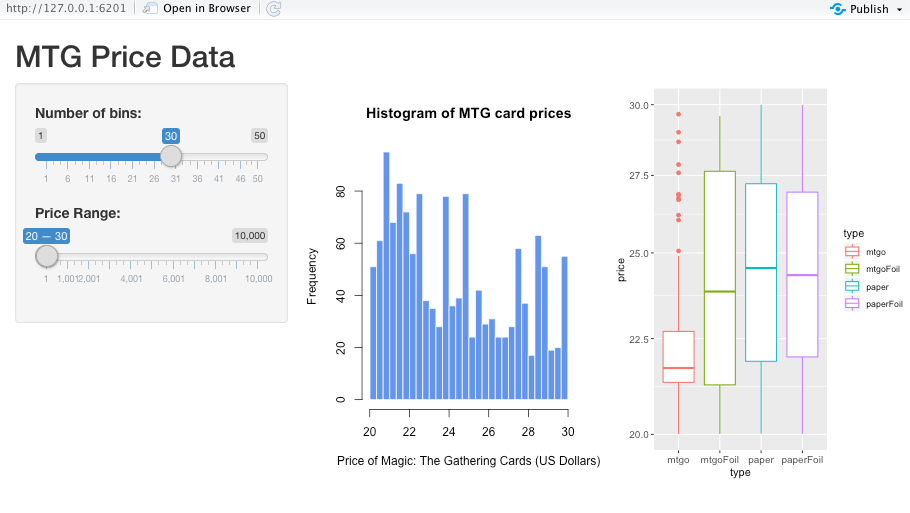
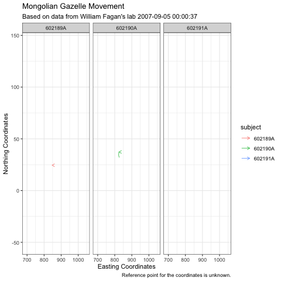
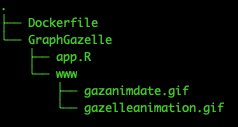

# R Shiny Markdown Practice
## A project designed to help me understand the nuances of using R Shiny Dashboard and its applications 

R Shiny Dashboard is a flexible tool that allows you to build dashboards that are interactable. It allows one to display information in a website format (.html). Not only can it display charts, data points, and animations, it allows users to create interactable widgets which can be used to alter the output of the data and give more dynamic information. This will chronicle my journey in using R Shiny Dashboard.

### The Beginning

I began by familiarizing myself with R Shiny, which is an R package that allows you to use many of the features of R Shiny Dashboard, without the improved GUI.

I decided to analyze a database in R Shiny, specifically a database for the trading card game Magic: The Gathering (MTG) using RSQLite. 

```{r}
library(shiny)
library(dbplyr)
library(dplyr)
library(ggplot2)
library(gridExtra)

mtg <- DBI::dbConnect(
    drv = RSQLite::SQLite(), 
    dbname = "AllPrintings.sqlite")

```
First, I extracted the information from the database into "mtg", which is an SQLite connection.

```

# Define UI for application that draws a histogram
ui <- fluidPage(

    # Application title
    titlePanel("MTG Price Data"),

    # Sidebar with a slider input for number of bins 
    sidebarLayout(
        sidebarPanel(
            sliderInput("bins",
                        "Number of bins:",
                        min = 1,
                        max = 50,
                        value = 30),
        
            sliderInput("price",
                        "Price Range:",
                        min = 1,
                        max = 10000,
                        value = c(20,30))
        ),

        # Show a plot of the generated distribution
        mainPanel(
            fluidRow(
                splitLayout(cellWidths = c("50%","50%"),
           plotOutput("distPlot"),
           plotOutput("boxPlot"))
            )
        )
    )
    
)
```
The ui is the part of shiny that governs the input, i.e interactive widgets the user can use to change the output. In this example, I created sliders to control a histogram and a boxplot to represent the price trends in different types of MTG cards.

```
# Define server logic required to draw a histogram
server <- function(input, output) {
    
    plotInput <- reactive({
        list(cardprice = (mtg %>% dbReadTable("prices")),
            dat = subset(cardprice, price<input$price[2] & price>input$price[1])
        )
    })
    
    output$distPlot <- renderPlot({
        
        
        hist(selectprice, breaks = bins, col = 'cornflowerblue', border = 'white', 
             xlab = "Price of Magic: The Gathering Cards (US Dollars)",
             main = "Histogram of MTG card prices")
        
        
    })
    
    output$boxPlot <- renderPlot({
        origplot <- ggplot(plotInput()$dat, aes(type, price, col=type)) + geom_boxplot() + scale_y_log10()
        newplot <- origplot + theme(axis.text = element_text(size = 10))
        print(newplot)
    })
    
}

# Run the application 
shinyApp(ui = ui, server = server)

```
Here, the server takes the input from the ui and adjusts the image of the charts. Generally, you want to put any changeable value into a reactive({}) function, which can [make the app faster](https://shiny.rstudio.com/tutorial/written-tutorial/lesson6/).

Output:


Pretty cool, right?
You can find the code under app.R.

I decided to go one step further and try to implement an R Shiny Dashboard 

```{r}
library(shiny)
library(shinydashboard)
library(dbplyr)
library(dplyr)
library(ggplot2)
library(gridExtra)

mtg <- DBI::dbConnect(
  drv = RSQLite::SQLite(), 
  dbname = "AllPrintings.sqlite")

ui <- dashboardPage(
  dashboardHeader(title = "MTG Statistics"),
  dashboardSidebar(),
  dashboardBody(
    fluidRow(
      box(plotOutput("histogram", height=250)),
      box(
        title = "Number of Bins:",
        sliderInput("bins",
                    "Number of bins:",
                    min = 1,
                    max = 50,
                    value = 30)
      ),
      box(
        title = "MTG Card Prices",
        sliderInput("price", "Price Range:", min = 0, max = 10000, value = c(20,30))
      )
    )
  )
)

server <- function(input, output) {
  plotInput <- reactive({
    list(cardprice = (mtg %>% dbReadTable("prices")),
         dat = subset(cardprice, price<input$price[2] & price>input$price[1])
    )
  })
  
  output$histogram <- renderPlot({
    
    hist(selectprice, breaks = bins, col = 'cornflowerblue', border = 'white', 
         xlab = "Price of Magic: The Gathering Cards (US Dollars)",
         main = "Histogram of MTG card prices")

  })
}

shinyApp(ui, server)
```

It's very similar to R Shiny, and the only changes you need to make is to the ui by adding the various dashboardHeader, dashboardBody, box, etc.
You can try this out under RDatabasePractice.R

However, what if I tried to animate the charts? 

Well, that would be fun to watch!

As a change of scenery, I decided to graph the movement of Mongolian Gazelle, with the data found in the [SyncMove](https://rdrr.io/cran/SyncMove/) package by Martin Rimmler and Thomas Mueller. The animations were made possible by [gganimate](https://gganimate.com/).

```{r}
library(tidyverse)
library(shiny)
library(shinyjs)
library(shinydashboard)
library(SyncMove)
library(geosphere)
library(gganimate)
library(gifski)
library(shinycssloaders)

ui <- dashboardPage(
  dashboardHeader(
    title = "Mongolian Gazelle Movement", 
    titleWidth = 300
  ),
  dashboardSidebar(
    conditionalPanel(condition = "!output.setupComplete",
                     box(title = "loading"))
  ),
  dashboardBody(
    
    fluidRow(
      box(imageOutput("animation", inline=TRUE) %>% withSpinner(color="blue", type=6),  width=6),
      box(width=6, plotOutput("scatterplot"))
    ),
    fluidRow(
      box(
        title = "Location of Gazelle on specific days.", width = 4,
        dateRangeInput("daterange", "Date:", start = "2007-09-05" , end = "2008-07-26", min = "2007-09-05", max = "2008-07-26")
      ),
      box(width = 4,
        radioButtons("id", "Distance traveled by ", choices = as.list(unique(gazelleRelocations$individual.local.identifier)))
      ),
    
   
      infoBoxOutput("distance"),
      
    )
  )
)

server <- function(input, output) {
  rv <- reactiveValues()
  rv$setupComplete <- FALSE
  dat <- gazelleRelocations %>% setNames(c("subject", "gender", "time", "x1", "y1")) %>% mutate(x2=lead(x1), y2=lead(y1)) %>% mutate(time=strptime(time, format = "%Y-%m-%d %H:%M:%S") %>% as.POSIXct)
  
  plotInput <- reactive({
   changingdat <- subset(x=dat,(dat$time >= input$daterange[1]) & (dat$time <= input$daterange[2]))
  })
  
 
  
  output$animation <- renderImage({

    #Uncomment the following paragraph to generate gifs in real time.
    #gazgraph <- ggplot(dat)  + geom_path(aes(x = x1, y = y1, colour = subject), arrow=arrow(length = unit(5, "points")), alpha=0.7) 
    #gazgraph <- gazgraph + facet_wrap(~subject) + theme_bw() + labs(title = "Mongolian Gazelle Movement", subtitle = "Based on data from William Fagan's lab", x = "Easting Coordinates", y = "Northing Coordinates", caption = "Reference point for the coordinates is unknown.") + transition_reveal(along=date)
    #animate(gazgraph, fps=5, renderer = gifski_renderer("imgs/anim.gif"))


    list(src = "www/gazanimdate.gif",
         contentType = 'image/gif'
         # width = 400,
         # height = 300,
         # alt = "This is alternate text"
    )
  },deleteFile = FALSE) # end of renderImage
  
  output$scatterplot <- renderPlot({
    gazellegraph <- ggplot(plotInput())  + geom_segment(aes(x = x1, y = y1, xend=x2, yend=y2, colour = subject), arrow=arrow(length = unit(5, "points")), alpha=0.7) 
    gazellegraph <- gazellegraph + facet_wrap(~subject) + theme_bw() + labs(title = "Mongolian Gazelle Movement", subtitle = "Based on data from William Fagan's lab", x = "Easting Coordinates", y = "Northing Coordinates", caption = "Reference point for the coordinates is unknown.")
    print(gazellegraph)
  })
  
  
  
  
  output$distance <- renderInfoBox({
    dat<-subset(plotInput(), subject==input$id)
    
    tripLength <- round(sqrt((dat$x2-dat$x1)**2 + (dat$y2-dat$y1)**2),digits=1)
    infoBox(
      title = paste(unique(dat$subject),"Traveled",sep=" "),
      value = paste(sum(tripLength),"KM",sep=" "), color = "red", width = 4, fill = FALSE
      #title = "test", value="4 KM", color = "red", width = 4, fill = TRUE
    )
  })
  
  output$setupComplete <- reactive({
    return(rv$setupComplete)
  })
  outputOptions(output, 'setupComplete', suspendWhenHidden=FALSE)
  
}

shinyApp(ui, server)                           
```

The program can be ran with GraphGazelle.R if you want to see the gif in the R Shiny Dashboard. Since producing gifs take up a lot of time to recreate them, I downloaded the gifs and displayed them manually. If you want to make gifs in real time, simply follow the instructions near the renderImage function, and change renderImage > renderPlot and imageOutput > plotOutput.

Here is the animation produced:



Wonderful! But it was really hard finding all of the necessary packages, not to mention how system differences can prevent other from replicating these results. 
One of the ways we can ensure that the code
remains the same is to use [Docker](https://aws.amazon.com/docker/). Docker is a free container system that can be used to isolate applications and their dependencies in order to be able to share the application across the cloud with other users, connecting the workplace closer.

To facilitate the use of my project across multiple systems, I compiled GraphGazelle.R along with other necessary files to create a Docker Container.

Building a Docker file is relatively simple.
1. Create a directory which has a Dockerfile .txt and include all of you desired repositories/files in it.


2. In the Dockerfile, I based it off of [rocker/shiny](https://github.com/rocker-org/shiny), which helped built an R Shiny server for me. Make sure to edit the Dockerfile to apt-get and install any packages you need.
3. Next, you should run docker build. If you are in the working directory, you only need to use .(period).
    docker built .
        can also include -t so that you can call the tag.
4. Finally, just run docker run -p 3838:3838 (name/tag/ID/whatever), and the docker machine should run your R shiny server!